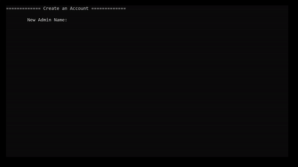
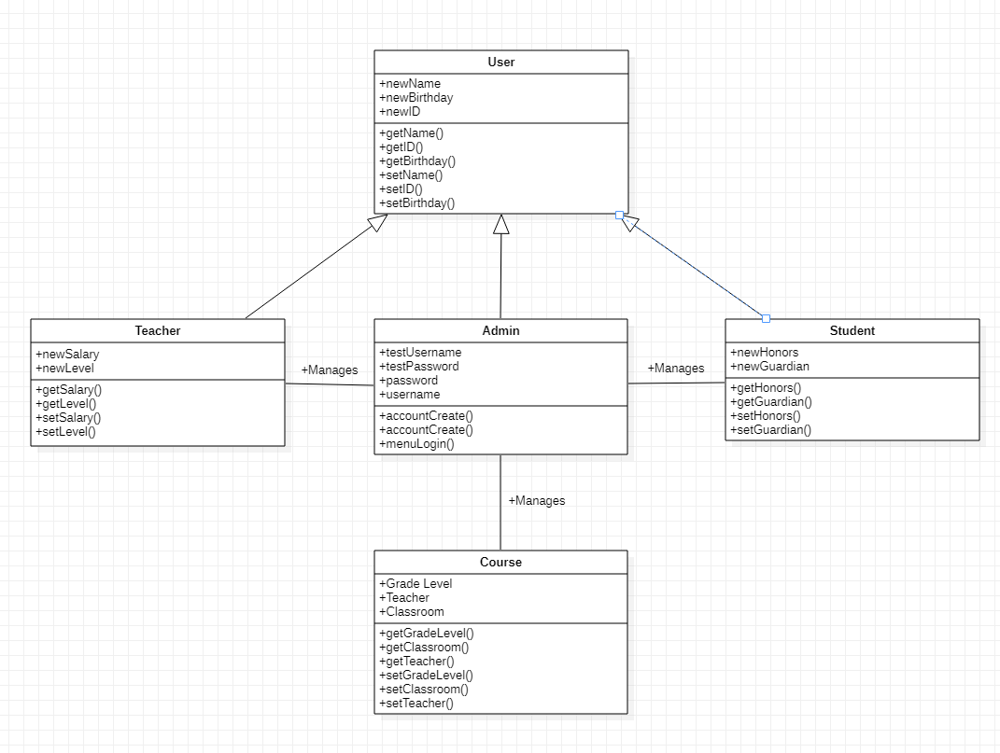
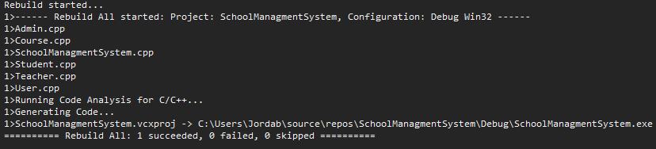
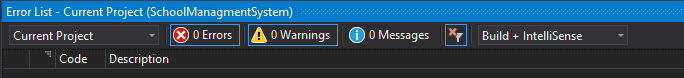

## High-school-Database

This program is a demonstration of using classes and subclasses to inherit feilds and methods in order to construct a vector of objects. It is structured to allow the user to create an admin account that will allow them to safely log in and create students, teachers, and classes that can be stored properly on a large scale. I made this as my final project for COP 3003 (Programming II / Object Oriented Programming) to demonstrate what I have learned. When I first made this project I had little to no experience creating classes that inherit to construct objects using overlaoded constructors. I struggled the most with data structures and manipulation, but I will be returning to fix this program after my completion of data structures & algorithms. as shown in the code I struggled to manipulate the vectors I created. I really enjoyed the creation of this program although I wish I had the ability to conceptualize and create a manipulatable data structure so I could pair students & teachers to their designated courses.   

## Demonstration
 

## Diagrams
Class Diagram:  
   
 
Code Analysis:  
   
 
Error List:  
   
 
## Built With

* Visual Studios
* C++
* StarUML  

## Contributing

If you would like to add more functionality then adding a way to append grades to a student and calculate their GPA would be an idea  

## Author

* Jordan Tatum

## Acknowledgments

* StackOverflow, cplusplus, programiz.  

## Key Programming Concepts Utilized

The three pillars of Object Oriented Programming, encapsulation, inheritance, and polymorphism.  

